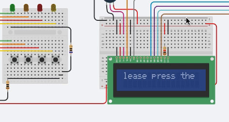

A term long project for my Mid Program Project Course @ Delaware State University

Due to the COVID-19 pandemic, we were forced to adjust on the fly rather than refunding students the money they spent on the course (though I still believe they should since we didn't get any parts out of it.....).

Regardless, the alternative for this course was a Virtual Arduino Project using TinkerCAD, which I decided to do a Matching LED game. I decided on this because most of my classmates wanted to do a smart trash can and I thought the idea was becoming quite repetitive. I opted to do something that was based on my original idea (Car based game using Raspberry PIs) and this was what I came up with.

Though not perfect, I was quite confident with the way it turned out. The code functions fairly well and progressively get's more difficult. Attached are links to my blog and the video presentation we did for the class.

 

Link to Blog: https://infotech295coivd19.wordpress.com/  
Link to Video: https://www.youtube.com/watch?v=WxfD5TnnsOE&feature=youtu.be
